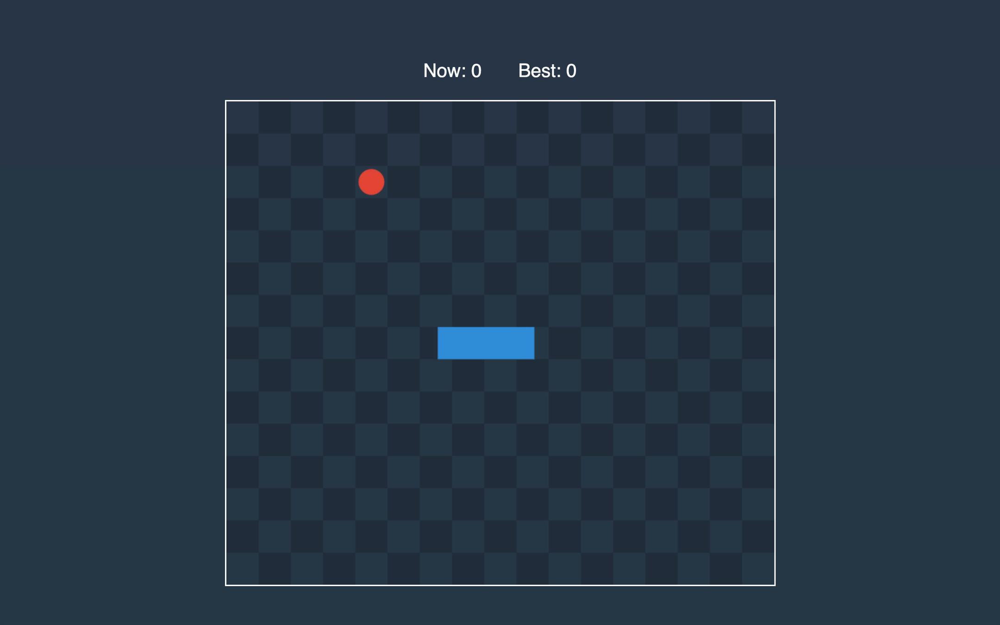

In this part, we will make that every time the snake eats the food, its tail grows longer.

## Process Food

Let’s add a method that will handle intersection with food, and call it from the *process*.

```rust:title=src/lib.rs
impl Game {
    // ...
    fn process_food(&mut self) {
        let snake_len = self.snake.len();
        let head_segment = Segment::new(&self.snake[snake_len - 2], &self.snake[snake_len - 1]);

        if head_segment.is_point_inside(&self.food) {
            let tail_end = &self.snake[0];
            let before_tail_end = &self.snake[1];
            let tail_segment = Segment::new(before_tail_end, &tail_end);
            let new_tail_end = tail_end.add(&tail_segment.get_vector().normalize());
            self.snake[0] = new_tail_end;
            self.food = get_food(self.width, self.height, &self.snake);
            self.score += 1;
        }
    }

    pub fn process(&mut self, timespan: f64, movement: Option<Movement>) {
        self.process_movement(timespan, movement);
        self.process_food();
    }
    // ...
}
```

If the center of the food is inside of the head segment, it means that there is an intersection. If this is the case, we take the tail tip segment to calculate a new position for the tail tip to make the snake one cell longer.

Let’s compile Rust and go to the JavaScript side.

## Storage

It is time to start saving the best score to local storage so that when the player visits the game next time, he could see his previous record.

```js:title=www/src/storage.js
export default {
  getBestScore: () => parseInt(localStorage.bestScore) || 0,
  setBestScore: (bestScore) => localStorage.setItem('bestScore', bestScore)
}
```

In the *GameManager*, we start passing the best score to the render method of the view, we updating the best score after calling the *process* method.

```js:title=www/src/game-manager.js
// ...
import Storage from './storage'

export class GameManager {
  // ...
  render() {
    this.view.render(
      this.game.food,
      this.game.get_snake(),
      this.game.score,
      Storage.getBestScore()
    )
  }

  tick() {
    if (!this.stopTime) {
      const lastUpdate = Date.now()
      if (this.lastUpdate) {
        this.game.process(lastUpdate - this.lastUpdate, this.controller.movement)
        if (this.game.score > Storage.getBestScore()) {
          localStorage.setItem('bestScore', this.game.score)
          Storage.setBestScore(this.game.score)
        }
      }
      this.lastUpdate = lastUpdate
      this.render()
    }
  }
  // ...
}
```

Now we can open the web page and start hunting the food!


