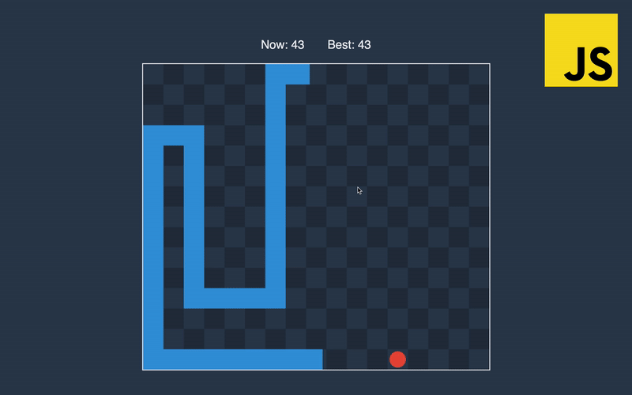

In this part, we will implement immutable classes for vectors and segments, that will be used heavily for tasks like detecting collisions or specifying coordinates and directions. Let’s jump in!

## Vector

You can find the use of vectors in almost every imaginable type of game, and it is very important to know how they can be applied and what are the most popular operations are. In our game, we won’t have a dedicated class for points, because vector will be sufficient both to specify the directions and coordinates. If you are not quite comfortable with vectors, I highly encourage you to check out my [article](/blog/linear-algebra) where I show the basics with JavaScript examples.


From the picture above, we can see that each coordinate where snake shakes represented by the vector. We also use a vector to show the direction of the snakes head. And here two important notices here. First, is that we always will represent directions as a vector with a length equal to one. By using this convention, we can move the snake head by adding its direction scaled by the distance. The second moment is that we will assume that Y is pointing down, it is easier to think this way because on the screen start of coordinates in the top left corner.

```js:title=main.js
// #region geometry
class Vector {
  constructor(x, y) {
    this.x = x
    this.y = y
  }

  scaleBy(number) {
    return new Vector(this.x * number, this.y * number);
  }

  add({ x, y }) {
    return new Vector(this.x + x, this.y + y)
  }

  subtract({ x, y }) {
    return new Vector(this.x - x, this.y - y)
  }

  length() {
    return Math.hypot(this.x, this.y)
  }

  normalize() {
    return this.scaleBy(1 / this.length())
  }

  isOpposite(vector) {
    const { x, y } = this.add(vector)
    return areEqual(x, 0) && areEqual(y, 0)
  }

  equalTo({ x, y }) {
    return areEqual(this.x, x) && areEqual(this.y, y)
  }
}
```

We call class immutable because all of its methods return new value without mutating its state(*x* and *y*). All methods except the last two are described in the article mentioned earlier.

We need the last method to check if two vectors equal by using the function from the previous part. If snake moves to the right and player press left button, we will detect if directions are the complete opposite, and will ignore the change of the movement.


## Segment

Now let’s implement the Segment class that will be used to detect snake self-intersection and to check if some cell on the field is free to place food. The constructor of the Segment class receives two vectors as coordinates of its start and end.

```js:title=main.js
// #region geometry
// ...
class Segment {
  constructor(start, end) {
    this.start = start
    this.end = end
  }

  getVector() {
    return this.end.subtract(this.start)
  }

  length() {
    return this.getVector().length()
  }

  isPointInside(point) {
    const first = new Segment(this.start, point)
    const second = new Segment(point, this.end)
    return areEqual(this.length(), first.length() + second.length())
  }

  getProjectedPoint({ x, y }) {
    const { start, end } = this
    const { x: px, y: py } = end.subtract(start)
    const u = ((x - start.x) * px + (y - start.y) * py) / (px * px + py * py)
    return new Vector(start.x + u * px, start.y + u * py)
  }
}
```

To get the direction of the segment, we can subtract start from the end. We will represent snake as an array of vectors, and to get the direction of the snake, we can create a segment by passing to the *constructor* forehead as the end and head as the start. Then we can call *getVector().normalize()* and receive the direction.


One of the usages of *isPointInside()* is to check if snake collided with food. To do this, we will take the snake segment and check if the center of the food is inside of it.


Game is over when snake hits the border of the game or part of its tail. To check this second case, we will get the projection of the point onto the line of a segment and checking if the projected point is inside of snake segment.


The last thing left is to implement a function that will receive snake represented as an array of vector and will return an array of snake segments.

```js:title=main.js
// #region geometry
// ...
const getSegmentsFromVectors = vectors => getWithoutLastElement(vectors)
  .map((one, index) => new Segment(one, vectors[index + 1]))
// #endregion
```

In this part, we’ve implemented geometry classes that will be used for all kinds of operations later.
