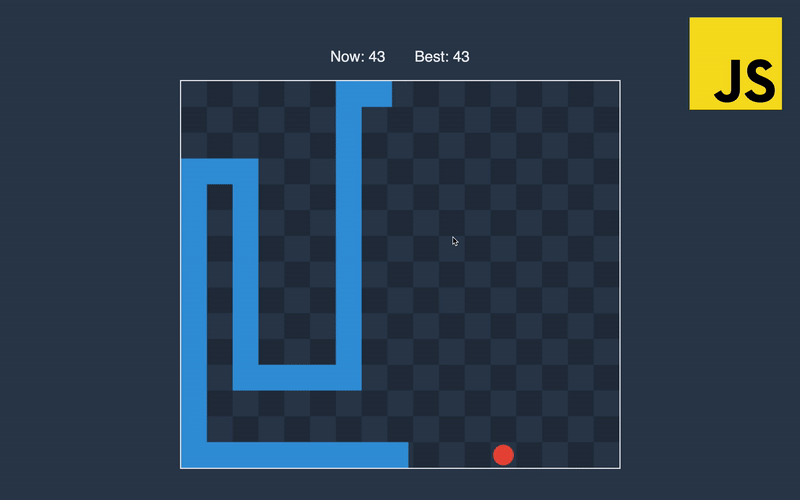
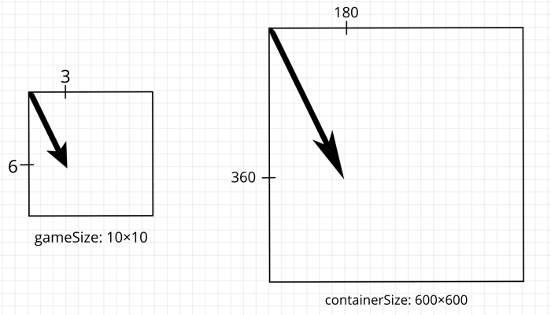
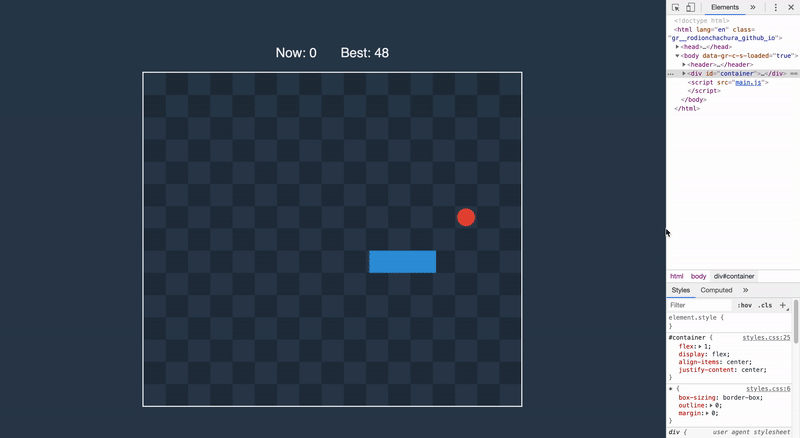

In this part, we are going to finish the game by implementing things like elements rendering, projectors, and game loop. Let’s jump in!

## Rendering

We need to somehow project the game state to the screen. In the example below — the point with coordinates *(3, 6)* in the game state projected on the screen to point at *(180, 360)*.



To do this, we will write a function that receives container size and size of the game field and returns an object with two projectors — for distances and for vectors.

```js:title=main.js
// #region rendering
const getProjectors = (containerSize, gameSize) => {
  const widthRatio = containerSize.width / gameSize.width
  const heightRatio = containerSize.height / gameSize.height
  const unitOnScreen = Math.min(widthRatio, heightRatio)

  return {
    projectDistance: distance => distance * unitOnScreen,
    projectPosition: position => position.scaleBy(unitOnScreen)
  }
}
```

To render game elements, we need access to the container element we put in the HTML back in the [first part](/blog/snake/start).

```js:title=main.js
// #region rendering
// ...
const getContainer = () => document.getElementById('container')

const getContainerSize = () => {
  const { width, height } = getContainer().getBoundingClientRect()
  return { width, height }
}

const clearContainer = () => {
  const container = getContainer()
  const [child] = container.children
  if (child) {
    container.removeChild(child)
  }
}
```

We can get container by id, and then obtain its width and height. To clear container, we remove its first and only child — canvas.

We will render all game elements on the canvas context, so we need a function to receive it.

```js:title=main.js
// #region rendering
// ...
const getContext = (width, height) => {
  const [existing] = document.getElementsByTagName('canvas')
  const canvas = existing || document.createElement('canvas')
  if (!existing) {
    getContainer().appendChild(canvas)
  }
  const context = canvas.getContext('2d')
  context.clearRect(0, 0, canvas.width, canvas.height)
  canvas.setAttribute('width', width)
  canvas.setAttribute('height', height)
  return context
}
```

We have separate functions to display cells, food, snake, and scores. The main render function receives state object, calculate all parameters needed for other functions, and put everything on the screen.

```js:title=main.js
// #region rendering
// ...
const renderCells = (context, sellSide, width, height) => {
  context.globalAlpha = 0.2
  getRange(width).forEach(column => getRange(height).forEach(row => {
    if ((column + row) % 2 === 1) {
      context.fillRect(column * sellSide, row * sellSide, sellSide, sellSide)
    }
  }))
  context.globalAlpha = 1
}

const renderFood = (context, sellSide, { x, y }) => {
  context.beginPath()
  context.arc(x, y, sellSide / 2.5, 0, 2 * Math.PI)
  context.fillStyle = '#e74c3c'
  context.fill()
}

const renderSnake = (context, sellSide, snake) => {
  context.lineWidth = sellSide
  context.strokeStyle = '#3498db'
  context.beginPath()
  snake.forEach(({ x, y }) => context.lineTo(x, y))
  context.stroke()
}

const renderScores = (score, bestScore) => {
  document.getElementById('current-score').innerText = score
  document.getElementById('best-score').innerText = bestScore
}

const render = ({
  game: {
    width,
    height,
    food,
    snake,
    score
  }, 
  bestScore,
  projectDistance,
  projectPosition
}) => {
  const [viewWidth, viewHeight] = [width, height].map(projectDistance)
  const context = getContext(viewWidth, viewHeight)
  const cellSide = viewWidth / width
  renderCells(context, cellSide, width, height)
  renderFood(context, cellSide, projectPosition(food))
  renderSnake(context, cellSide, snake.map(projectPosition))
  renderScores(score, bestScore)
}
// #endregion
```

## Main

State of the whole game is an object, and the same way as with game state, we will write a function that generates initial state for the application.

```js:title=main.js
// #region main
const getInitialState = () => {
  const containerSize = getContainerSize()
  const game = getGameInitialState()
  return {
    ...containerSize,
    game,
    ...getProjectors(containerSize, game),
    bestScore: parseInt(localStorage.bestScore) || 0
  }
}
```

The function takes container size and game initial state to pack everything together. Worth to mention that projectors are also in the application state.

Inside of the game loop, we will call a function listed below to receive a new state.

```js:title=main.js
// #region main
// ...
const getNewStatePropsOnTick = oldState => {
  if (oldState.stopTime) return {}

  const lastUpdate = Date.now()
  if (oldState.lastUpdate) {
    const game = getNewGameState(oldState.game, oldState.movement, lastUpdate - oldState.lastUpdate)
    const newProps = {
      game,
      lastUpdate
    }
    if (game.score > oldState.bestScore) {
      localStorage.setItem('bestScore', game.score)
      return {
        ...newProps,
        bestScore: game.score
      }
    }
    return newProps
  }

  return {
    lastUpdate
  }
}
```

If the game not stopped we are receiving a new game state and update the best score that saved in the local storage, so that it is not lost when the player closes a browser tab.

Now we are ready to put everything together.

```js:title=main.js
// #region main
// ...
const startGame = () => {
  let state = getInitialState()
  const updateState = props => {
    state  = { ...state, ...props}
  }

  window.addEventListener('resize', () => {
    clearContainer()
    const containerSize = getContainerSize()
    updateState({ ...containerSize, ...getProjectors(containerSize, state.game) })
    tick()
  })
  window.addEventListener('keydown', ({ which }) => {
    const [movement] = Object.entries(MOVEMENT_KEYS).find(([_, keys]) => keys.includes(which)) || [undefined]
    updateState({ movement })
  })
  window.addEventListener('keyup', ({ which }) => {
    updateState({ movement: undefined })
    if (which === STOP_KEY) {
      const now = Date.now()
      if (state.stopTime) {
        updateState({ stopTime: undefined, lastUpdate: state.time + now - state.lastUpdate })
      } else {
        updateState({ stopTime: now })
      }
    }
  })

  const tick = () => {
    updateState(getNewStatePropsOnTick(state))
    render(state)
  }
  setInterval(tick, UPDATE_EVERY)
}
// #endregion

startGame()
```

In this function, we have the only *let* keyword in the entire game. We will update the state by calling a function declared at the start of the body.

The first event listener allows us to have a smooth picture when the screen changes its size. When resize happens, we will clear container, attach new canvas, update state with new projectors, and call *tick()* extra.



On *keydown* events, we update the state with new movement value. On *keyup* event, we clear movement and check if the player wants to stop or resume the game. On the stop, we will save the time of the game stop, and on a resume, we will calculate a new value for the last update.

At the end of the function, we are starting the game loop that consists of updating game state and rerendering.

Now, you can open the file in the browser and enjoy the game! To take most from this series I highly recommend you to make changes in the game to improve your skills. There is a list of possible things I think of that can be done next:

1. Make a snake look more realistic by making it rounded and with an actual head.🐍

1. Increase the length of the snake only when its tail reaches the point of the eaten food position.

1. Sound when snake changes direction or eats the food.

1. Make an interesting animation when the snake hits the wall or eats the food.

In this series, we implemented the classic snake game. Thanks for staying until the end!
