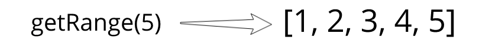

In the first part of this series, we will write all HTML and CSS and implement a few utility functions that we will often use in the game.

## HTML

In the HTML file, we will have a header with text that shows current and best score of the player, and container to which will be attached *canvas*.

```html:title=index.html
<!DOCTYPE html>
<html lang="en">
  <head>
    <meta charset="utf-8" />
    <meta name="viewport" content="width=device-width, initial-scale=1" />
    <title>Snake Game</title>
    <link rel="stylesheet" href="styles.css">
  </head>
  <body>
    <header>
      <p>Now: <span id="current-score"></span></p>
      <p>Best: <span id="best-score"></span></p>
    </header>
    <div id="container"></div>
  </body>
  <script src="main.js"></script>
</html>
```

Besides HTML file, we will also have one file with code for the game and one file with styles that we are loading via *link* and *script* attributes.

## CSS

We have nothing fancy in styles. To make content take the full height of the page — we are making the height of *html* and *body* equal to*100%*. Our goal is to make the game look cool on any screen size, to do so we will make text size in percents.

```css:title=styles.css
html {
  height: 100%;
  --text-color: #ecf0f1;
}

* {
  box-sizing: border-box;
  outline: 0;
  margin: 0;
}

body {
  height: 100%;
  background: #2c3e50;
  padding: 60px;
  font-family: sans-serif;
  display: flex;
  flex-direction: column;
}

canvas {
  border: 2px solid var(--text-color);
}

#container {
  flex: 1;
  display: flex;
  align-items: center;
  justify-content: center;
}

header {
  display: flex;
  flex-direction: row;
  align-items: center;
  justify-content: center;
  color: var(--text-color);
}

p {
  font-size: 3vmin;
  margin: 2%;
}
```

Most boring stuff is done and we won’t come back to the index.html and styles.css later in this series.

## JavaScript

Since we don’t use any libraries in this project, we won’t have a tool that will bandle our *.js* files in one. Also, we have not a big game so it will be alright if we will put everything in one place. To not lost in the JavaScript we will use VSCode feature that allows folding parts of the code via comments that start with *#region* and ends with *#endregion*.

```js:title=main.js
// #region general utils
// #endregion

// #region geometry
// #endregion

// #region constants
// #endregion

// #region game core
// #endregion

// #region rendering
// #endregion

// #region main
// #endregion
```

At the end of the series, we will fill each region and make an exciting snake game.

## General Utils

We start by creating a few utils that we will use in different parts of the game.

```js:title=main.js
// #region general utils
const getRange = length => [...Array(length).keys()]
const getRandomFrom = array => array[Math.floor(Math.random() * array.length)]
const getWithoutLastElement = array => array.slice(0, array.length - 1)
const getLastElement = array => array[array.length - 1]
const areEqual = (one, another) => Math.abs(one - another) < 0.000000000001
// #endregion
```

Below you can see examples of what they do.



![getRandomFrom([1, 2, 3, 4])](random.png)

![getWithoutLastElement([1, 2, 3, 4])](without-last.png)

![getLastElement([1, 2, 3, 4])](last.png)

The last function is checking if two float numbers are equal, by checking if their absolute difference is smaller than some super small number.

In this part, we’ve finished with HTML, CSS, and general utils.
