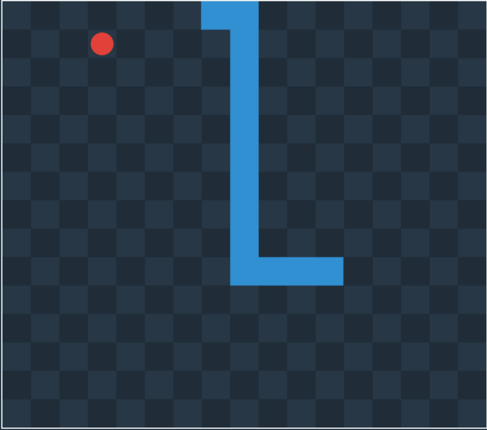
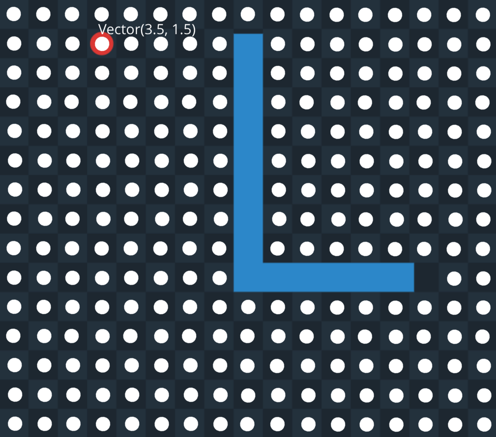
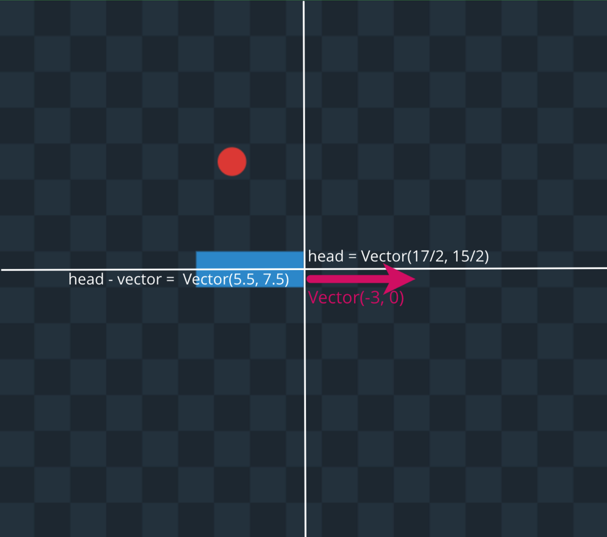
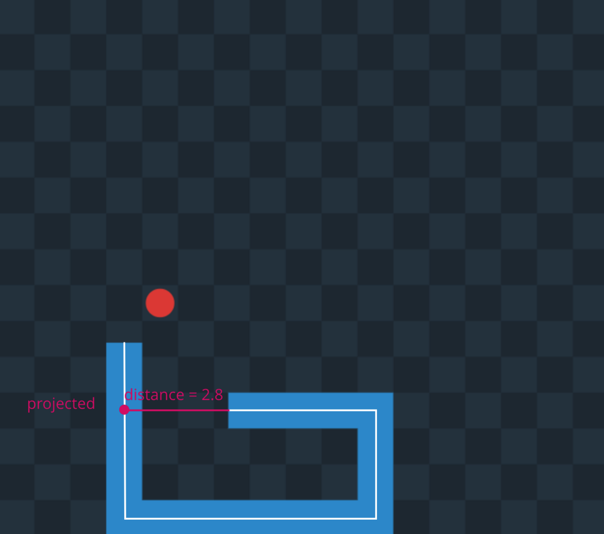

In this part, we will implement the part that deals with the game state. It includes detecting collisions, calculating the new position of the snake, and finding a free place to place food. Let’s jump in!

## Constants

First, let’s fill the region with constants that we will need throughout the code.

```js:title=main.js

// #region constants
const STOP_KEY = 32

const MOVEMENT_KEYS = {
  TOP: [87, 38],
  LEFT: [65, 37],
  RIGHT: [68, 39],
  DOWN: [83, 40]
}

const DIRECTION = {
  TOP: new Vector(0, -1),
  RIGHT: new Vector(1, 0),
  DOWN: new Vector(0, 1),
  LEFT: new Vector(-1, 0)
}

const DEFAULT_GAME_CONFIG = {
  width: 17,
  height: 15,
  speed: 0.006,
  initialSnakeLenght: 3,
  initialDirection: DIRECTION.RIGHT
}

const MOVEMENT = {
  TOP: 'TOP',
  RIGHT: 'RIGHT',
  DOWN: 'DOWN',
  LEFT: 'LEFT'
}

const UPDATE_EVERY = 1000 / 60
// #endregion
```

The first two variables we will use to see if the pressed key was space or a, w, d, s or left, top, right, down.

We can see that objects with movement keys, direction, and movement have the same keys. It will help us to escape typing errors.

A default config is an object. We will use it in the function that will generate the initial state for the game.

We are measuring time in the game in milliseconds and will update the state of the game and re-render everything 60 times per second, so that movement will look super-smooth.

## Core

We start the core region with a function that will find a free from the snake spot on the field to place food.

```js:title=main.js
// #region game core
const getFood = (width, height, snake) => {
  const allPositions = getRange(width).map(x =>
    getRange(height).map(y => new Vector(x + 0.5, y + 0.5))
  ).flat()
  const segments = getSegmentsFromVectors(snake)
  const freePositions = allPositions
    .filter(point => segments.every(segment => !segment.isPointInside(point)))
  return getRandomFrom(freePositions)
}
```

The function receives the width and height of the game with the snake. Worth to mention that the game coordinates don’t have any business with coordinates on the screen. In the core region, we don’t care if the game renders on canvas, SVG, or some virtual reality space. We measure distance in-game field cells. On the example below, we can see the game the width equal to 17 and height equal to 15.



First, we ignore the snake and generate all possible positions for food in the center of each cell. Then we filter all the points so that they are not inside some segment of the snake and randomly pick one of them.



When we can place food on the game field, we are ready to write the function that will create an initial state for the game.

```js:title=main.js
// #region game core
// ...
const getGameInitialState = (config = {}) => {
  const {
    width,
    height,
    speed,
    initialSnakeLenght,
    initialDirection
  } = { ...config, ...DEFAULT_GAME_CONFIG }
  const head = new Vector(
    Math.round(width / 2) - 0.5,
    Math.round(height / 2) - 0.5
  )
  const snake = [
    head.subtract(initialDirection.scaleBy(initialSnakeLenght)),
    head
  ]
  const food = getFood(width, height, snake)
  return {
    width,
    height,
    speed,
    initialSnakeLenght,
    initialDirection,
    snake,
    direction: initialDirection,
    food,
    score: 0
  }
}
```

In this function, we merge in a received state default state, create a snake, take food, and return an initial state.



Next, the function that will return a new direction given old direction in the form of vector and movement in the form of string.

```js:title=main.js
// #region game core
// ...
const getNewDirection = (oldDirection, movement) => {
  const newDirection = DIRECTION[movement]
  const shouldChange = newDirection && !oldDirection.isOpposite(newDirection)
  return shouldChange ? newDirection : oldDirection
}
```

It checks that movement is defined and direction is not opposed to the old one.

We have different logic for updating the position of the snake head and the rest of the body. To update the tail, we go over each snake segment and make it shorter or remove it at all.

```js:title=main.js
// #region game core
// ...
const getNewTail = (oldSnake, distance) => {
  const { tail } = getWithoutLastElement(oldSnake).reduce((acc, point, index) => {
    if (acc.tail.length !== 0) {
      return {
        ...acc,
        tail: [...acc.tail, point]
      }
    }

    const next = oldSnake[index + 1]
    const segment = new Segment(point, next)
    const length = segment.length()
    if (length >= distance) {
      const vector = segment.getVector().normalize().scaleBy(acc.distance)
      return {
        distance: 0,
        tail: [...acc.tail, point.add(vector)]
      }
    } else {
      return {
        ...acc,
        distance: acc.distance - length
      }
    }
  }, { distance, tail: [] })

  return tail
}

```

Process of new state generation consists of three parts:

1. Receive state after processing movement.

1. Receive state after processing possible collisions with food.

1. Check if the game is over.

The function for movement processing receives old state, movement in the form of a string, and calculated distance.

```js:title=main.js
// #region game core
// ...
const getStateAfterMoveProcessing = (state, movement, distance) => {
  const newTail = getNewTail(state.snake, distance)
  const oldHead = getLastElement(state.snake)
  const newHead = oldHead.add(state.direction.scaleBy(distance))
  const newDirection = getNewDirection(state.direction, movement)
  if (!state.direction.equalTo(newDirection)) {
    const { x: oldX, y: oldY } = oldHead
    const [
      oldXRounded,
      oldYRounded,
      newXRounded,
      newYRounded
    ] = [oldX, oldY, newHead.x, newHead.y].map(Math.round)
    const getStateWithBrokenSnake = (old, oldRounded, newRounded, getBreakpoint) => {
      const breakpointComponent = oldRounded + (newRounded > oldRounded ? 0.5 : -0.5)
      const breakpoint = getBreakpoint(breakpointComponent)
      const vector = newDirection.scaleBy(distance - Math.abs(old - breakpointComponent))
      const head = breakpoint.add(vector)
      return {
        ...state,
        direction: newDirection,
        snake: [...newTail, breakpoint, head]
      }
    }
    if (oldXRounded !== newXRounded) {
      return getStateWithBrokenSnake(oldX, oldXRounded, newXRounded, x => new Vector(x, oldY))
    }
    if (oldYRounded !== newYRounded) {
      return getStateWithBrokenSnake(oldY, oldYRounded, newYRounded, y => new Vector(oldX, y))
    }
  }
  return {
    ...state,
    snake: [...newTail, newHead]
  }
}

```

Here we need to catch the right moment for changing snake direction according to player movement. We are doing this by calculating a new position if so there was no movement change and then checking if the snake head crossed the center of the cell.

On the second stage, we make the snake tail on one unit longer and generate a new position for the food if segment with snake head intersect food.

```js:title=main.js
// #region game core
// ...
const getStateAfterFoodProcessing = (state) => {
  const headSegment = new Segment(
    getLastElement(getWithoutLastElement(state.snake)),
    getLastElement(state.snake)
  )
  if (!headSegment.isPointInside(state.food)) return state

  const [tailEnd, beforeTailEnd, ...restOfSnake] = state.snake
  const tailSegment = new Segment(beforeTailEnd, tailEnd)
  const newTailEnd = tailEnd.add(tailSegment.getVector().normalize())
  const snake = [newTailEnd, beforeTailEnd, ...restOfSnake]
  const food = getFood(state.width, state.height, snake)
  return {
    ...state,
    snake,
    score: state.score + 1,
    food
  }
}
```

Here we are leveraging our geometry functionality to detect intersection and calculate a new position for the tail.

Game is over when the snake goes outside the game field or when there is a self-intersection.

```js:title=main.js
const isGameOver = ({ snake, width, height }) => {
  const { x, y } = getLastElement(snake)
  if (x < 0 || x > width || y < 0 || y > height) {
    return true
  }
  if (snake.length < 5) return false

  const [head, ...tail] = snake.slice().reverse()
  return getSegmentsFromVectors(tail).slice(2).find(segment => {
    const projected = segment.getProjectedPoint(head)
    if (!segment.isPointInside(projected)) {
      return false
    }
    const distance = new Segment(head, projected).length()
    return  distance < 0.5
  })
}
```

To see if snake crosses boundaries, we take coordinates of the head and see if they are in the range between zero and width, height appropriately. Self-intersection can happen only when the number of points is more or equal to five. To see if the head intersects some segment we project head to the segment line, and if the projected point is inside of the segment and distance between it and the head is less than half of the cell it means that the game is over.



It receives an old state, movement in the form of string and time from the previous update.

```js:title=main.js
// #region game core
// ...
const getNewGameState = (state, movement, timespan) => {
  const distance = state.speed * timespan
  const stateAfterMove = getStateAfterMoveProcessing(state, movement, distance)
  const stateAfterFood = getStateAfterFoodProcessing(stateAfterMove)
  if (isGameOver(stateAfterFood)) {
    return getGameInitialState(state)
  }
  return stateAfterFood
}
// #endregion
```

To calculate distance, we multiple speed on the timespan. After updating the state, we check if the game is over and if so return the initial state.
