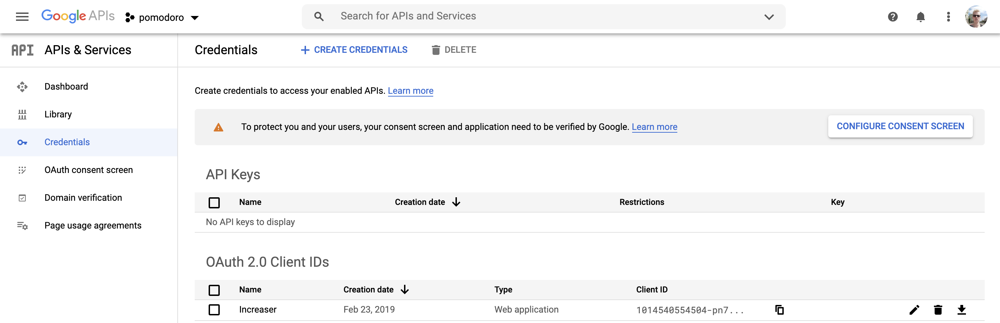
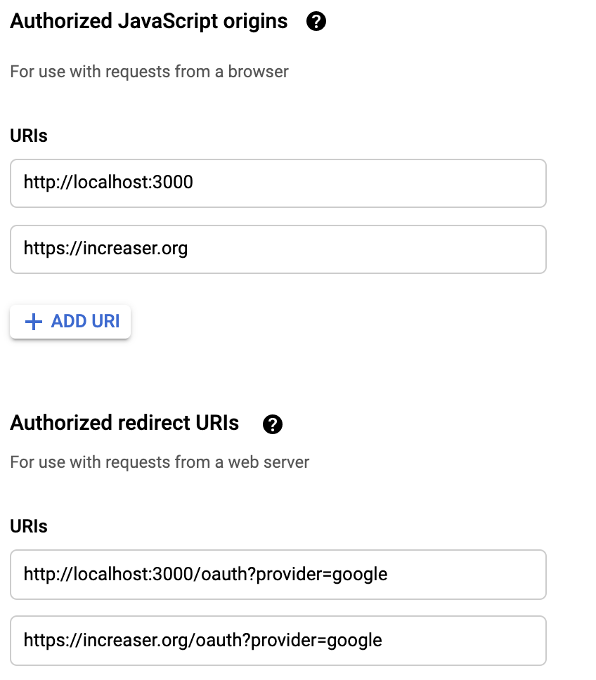
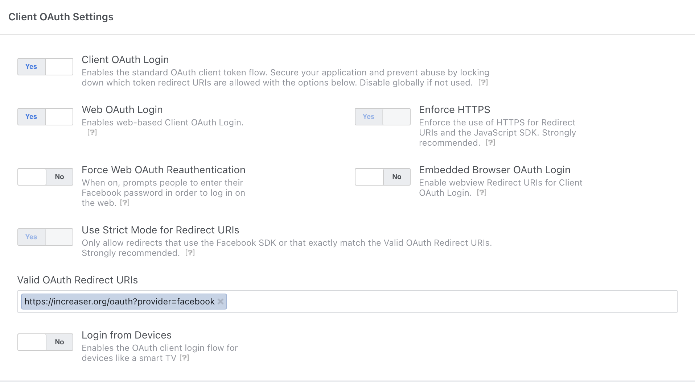
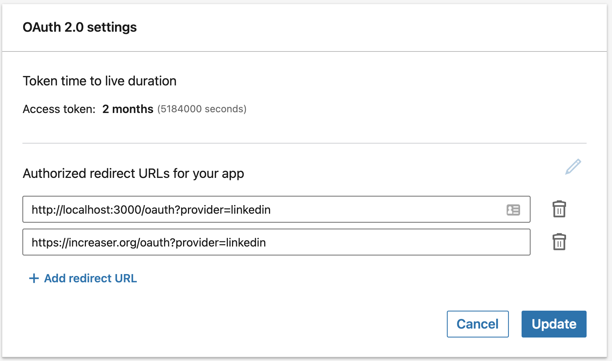

Recently I had to update and refactor authentication logic in [Increaser](https://increaser.org) app. After finishing the task, I decided to write a post so that other folks could add social auth to their apps much faster than I did.

## Step 1. Get Credentials

We will need pairs of `CLIENT_ID` and `CLIENT_SECRET` for every provider to implement authentication on the front-end and the back-end.

To use Google, we need to create a project in [Google Developer Console](https://console.developers.google.com/), go to the credentials tab and add OAuth 2.0 Client.



In [Increaser](https://increaser.org), I have two client origins, one for development with localhost and another for the production version.



Redirect URIs is where you want a user to appear after authorization. Every provider will attach query parameters to the specified URI so that we could handle them on the front-end and process them on the back-end. We will use the same route for all providers and will distinguish them by query parameter `provider`.

To use Facebook, we need to create an app on [Facebook for Developers](https://developers.facebook.com/). The procedure looks similar, this is what we will have on Client OAuth Settings.



To use LinkedIn, we go to [LinkedIn Developers](https://www.linkedin.com/developers) and create an app there too.



## Step 2. React Component

In Increaser, I share one component with authorization buttons between sign-in and sign-up modals. You could see that the only difference is that the text changes depending on the purpose of the popup.


The component calls a function to get authentication links. Then it goes over each available provider and renders a reusable button component that acts as a link. Every button has a distinct color, icon, and text.

```js:title=src/components/auth/providers.js
import React from 'react'
import styled from 'styled-components'
import {
  faGoogle,
  faFacebookSquare,
  faLinkedin
} from '@fortawesome/free-brands-svg-icons'

import Button from '../reusable/button'
import { PROVIDER, PROVIDER_NAME } from 'constants/auth'
import { useTranslation } from 'internalization'
import { getProvidersUrls } from 'utils/auth'

const PROVIDER_COLOR = {
  [PROVIDER.GOOGLE]: '#4285F4',
  [PROVIDER.LINKEDIN]: '#0073b1',
  [PROVIDER.FACEBOOK]: '#4267b2'
}

const PROVIDER_ICON = {
  [PROVIDER.GOOGLE]: faGoogle,
  [PROVIDER.LINKEDIN]: faLinkedin,
  [PROVIDER.FACEBOOK]: faFacebookSquare
}

const ButtonWrapper = styled.div`
  margin: 10px 0;
`

const Providers = ({ purpose }) => {
  const { t } = useTranslation()
  const text = t('auth.modal')[purpose]

  const providersUrls = getProvidersUrls()

  return Object.keys(PROVIDER).map(provider => 
    <ButtonWrapper key={provider}>
      <Button
        linkTo={providersUrls[provider]}
        externalInSameTab
        background={PROVIDER_COLOR[provider]}
        text={`${text.button} ${PROVIDER_NAME[provider]}`}
        icon={PROVIDER_ICON[provider]}
      />
    </ButtonWrapper>
  )
}
```

Below we could see constants related to authorization. We could find here pairs of URLs and scopes for every provider.

```js:title=src/constants/auth.js
export const GOOGLE_AUTH_URL = 'https://accounts.google.com/o/oauth2/v2/auth'
export const GOOGLE_SCOPE =
  'https://www.googleapis.com/auth/userinfo.email https://www.googleapis.com/auth/userinfo.profile'

export const FACEBOOK_AUTH_URL = 'https://www.facebook.com/v4.0/dialog/oauth'
export const FACEBOOK_SCOPE = 'public_profile,email'

export const LINKEDIN_AUTH_URL =
  'https://www.linkedin.com/oauth/v2/authorization'
export const LINKEDIN_SCOPE = 'r_liteprofile r_emailaddress'

export const PROVIDER = {
  GOOGLE: 'GOOGLE',
  FACEBOOK: 'FACEBOOK',
  LINKEDIN: 'LINKEDIN'
}

export const MODAL_PURPOSE = {
  SIGN_UP: 'SIGN_UP',
  SIGN_IN: 'SIGN_IN'
}

export const PROVIDER_NAME = {
  [PROVIDER.GOOGLE]: 'Google',
  [PROVIDER.LINKEDIN]: 'LinkedIn',
  [PROVIDER.FACEBOOK]: 'Facebook'
}
```

Now we want to transform these constants into authorization URLs. We are using the two helpers function to attach query parameters to a given URL.

```js:title=src/utils/auth.js
const getURLWithQueryParams = (base, params) => {
  const query = Object.entries(params)
    .map(([key, value]) => `${key}=${encodeURIComponent(value)}`)
    .join('&')

  return `${base}?${query}`
}

export const getRedirectUri = provider =>
  `${window.location.origin}${PATH.OAUTH}?provider=${provider.toLowerCase()}`

export const getProvidersUrls = () => ({
  [PROVIDER.GOOGLE]: getURLWithQueryParams(GOOGLE_AUTH_URL, {
    client_id: process.env.REACT_APP_GOOGLE_CLIENT_ID,
    redirect_uri: getRedirectUri(PROVIDER.GOOGLE),
    scope: GOOGLE_SCOPE,
    response_type: 'code',
    access_type: 'offline',
    prompt: 'consent'
  }),
  [PROVIDER.FACEBOOK]: getURLWithQueryParams(FACEBOOK_AUTH_URL, {
    client_id: process.env.REACT_APP_FACEBOOK_APP_ID,
    redirect_uri: getRedirectUri(PROVIDER.FACEBOOK),
    scope: FACEBOOK_SCOPE,
    response_type: 'code',
    auth_type: 'rerequest',
    display: 'popup'
  }),
  [PROVIDER.LINKEDIN]: getURLWithQueryParams(LINKEDIN_AUTH_URL, {
    response_type: 'code',
    client_id: process.env.REACT_APP_LINKEDIN_CLIENT_ID,
    redirect_uri: getRedirectUri(PROVIDER.LINKEDIN),
    scope: LINKEDIN_SCOPE
  })
})
```

Once the user signed-in with a provider, he will appear on the /oauth page. In [Increaser](https://increaser.org) this page is empty.

```js:title=src/components/auth/oauth.js
const OAuth = ({ processOAuthParams }) => {
  useEffect(() => {
    processOAuthParams()
  }, [processOAuthParams])

  return null
}
```

The component calls actions that trigger a specific saga that transforms query parameters into an object. Then it takes the code and the name of the provider to make the identification query to the back-end. There is also some [Increaser](https://increaser.org)-specific code. If it was the first identification, it means that the user just signed up, and the app will start the onboarding. Also, after identification will be made an additional query to synchronize the app.

```js:title=src/sagas/auth.js
const queryToObject = queryString => {
  const pairsString =
    queryString[0] === '?' ? queryString.slice(1) : queryString
  const pairs = pairsString
    .split('&')
    .map(str => str.split('=').map(decodeURIComponent))
  return pairs.reduce((acc, [key, value]) => {
    if (key) {
      acc[key] = value
    }

    return acc
  }, {})
}

export function* processOAuthParams() {
  const queryString = window.location.search
  history.push(PATH.TIME_PICKER)

  if (queryString) {
    const { code, provider: lowProvider } = queryToObject(queryString)
    const provider = lowProvider && PROVIDER[lowProvider.toUpperCase()]
    if (provider) {
      try {
        const query = IDENTIFY_WITH_OAUTH_QUERY(
          provider,
          code,
          getRedirectUri(provider),
          offsetedUtils.getOffset()
        )
        const { identifyWithOAuth } = yield callApi(query)
        yield put(receiveAuthData(identifyWithOAuth))
        if (identifyWithOAuth.firstIdentification) {
          yield put(showAfterSignUpModal())
          getAnalytics().finishSignUp()
        }
        yield* synchronize()
      } catch (err) {
        yield put(failToProcessOAuthParams())
        reportError('Fail to Authorize', err)
      }
    }
  }
}
```

## Step 3. NodeJS Back-end

[Increaser](https://increaser.org) utilizes GraphQL on the back-end. It has one query that is used both for sign-in and sign-up, returning basic user info and JWT token.

```graphql
type User {
  id: ID
  email: String
  name: String
  token: String
  tokenExpirationTime: Int
  firstIdentification: Boolean
}

enum AuthProvider {
  GOOGLE
  FACEBOOK
  LINKEDIN
}

type Query {
  identifyWithOAuth(
    provider: AuthProvider!
    code: String!
    redirectUri: String!
  ): User
}
```

We won't look into the implementation of the query's handler because it has too much [Increaser](https://increaser.org)-specific code. What we will pay attention to is how we validate the code from the front-end and get information such as email and name from the provider.

```js:title=src/utils/auth.js
const { URLSearchParams } = require('url')
const jwt = require('jsonwebtoken')
const fetch = require('node-fetch')


const GOOGLE_TOKEN: 'https://oauth2.googleapis.com/token'
const GOOGLE_USER_INFO: 'https://www.googleapis.com/oauth2/v2/userinfo'

const FACEBOOK_TOKEN: 'https://graph.facebook.com/v4.0/oauth/access_token'
const FACEBOOK_USER_INFO: 'https://graph.facebook.com/me'

const LINKEDIN_TOKEN: `https://www.linkedin.com/oauth/v2/accessToken`
const LINKEDIN_NAME: 'https://api.linkedin.com/v2/me'
const LINKEDIN_EMAIL: 'https://api.linkedin.com/v2/emailAddress?q=members&projection=(elements*(handle~))'

const fetchJSON = (...args) => fetch(...args).then(r => r.json())

module.exports = {
  getValidatedWithGoogleUser: async (code, redirectUri) => {
    const { access_token } = await fetchJSON(GOOGLE_TOKEN, {
      method: 'POST',
      body: JSON.stringify({
        client_id: process.env.GOOGLE_CLIENT_ID,
        client_secret: process.env.GOOGLE_CLIENT_SECRET,
        redirect_uri: redirectUri,
        grant_type: 'authorization_code',
        code
      })
    })
    const userData = await fetchJSON(GOOGLE_USER_INFO, {
      method: 'GET',
      headers: {
        Authorization: `Bearer ${access_token}`
      }
    })

    return userData
  },
  getValidatedWithFacebookUser: async (code, redirectUri) => {
    const tokenUrl = getURLWithQueryParams(FACEBOOK_TOKEN, {
      client_id: process.env.FACEBOOK_CLIENT_ID,
      client_secret: process.env.FACEBOOK_CLIENT_SECRET,
      redirect_uri: redirectUri,
      code
    })
    const { access_token } = await fetchJSON(tokenUrl)
    const dataUrl = getURLWithQueryParams(FACEBOOK_USER_INFO, {
      fields: ['email', 'name'].join(','),
      access_token
    })
    const userData = await fetchJSON(dataUrl)
    return userData
  },
  getValidatedWithLinkedinUser: async (code, redirectUri) => {
    const body = new URLSearchParams({
      grant_type: 'authorization_code',
      code,
      redirect_uri: redirectUri,
      client_id: process.env.LINKEDIN_CLIENT_ID,
      client_secret: process.env.LINKEDIN_CLIENT_SECRET
    })
    const { access_token } = await fetchJSON(LINKEDIN_TOKEN, {
      method: 'POST',
      body
    })
    const payload = {
      method: 'GET',
      headers: { Authorization: `Bearer ${access_token}` }
    }
    const { localizedFirstName, localizedLastName } = await fetchJSON(
      LINKEDIN_NAME,
      payload
    )
    const userData = {
      name: `${localizedFirstName} ${localizedLastName}`
    }
    const response = await fetchJSON(LINKEDIN_EMAIL, payload)
    if (response.elements) {
      userData.email = response.elements[0]['handle~'].emailAddress
    }

    return userData
  }
}
```

As we could see, we go through the same procedure for every provider. First, we obtain `access_token` and use it to receive the user's info. In [Increaser](https://increaser.org), once the user is validated, the back-end generates auth data via [jsonwebtoken](https://github.com/auth0/node-jsonwebtoken) library.

```js:title=src/utils/auth.js
const jwt = require('jsonwebtoken')

const generateAuthData = id => {
  const tokenExpirationTime =
    Math.floor(Date.now() / 1000) + process.env.JWT_LIFESPAN_IN_SECONDS
  return {
    token: jwt.sign({ id, exp: tokenExpirationTime }, process.env.SECRET),
    tokenExpirationTime
  }
}
```

That's all. Maybe I didn't cover everything, yet I believe you could fill up the gaps :)