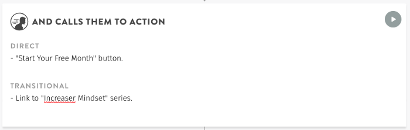

## Introduction

I released [increaser.org](https://increaser.org/) half a year ago and during this time only 10% of visitors registered in the app. Therefore I decided to start research on what I can do to increase the percentage of registered users.

I started by reading “[Building a StoryBrand](https://www.amazon.com/Building-StoryBrand-Clarify-Message-Customers/dp/0718033329)”. The main message of this book is — by applying seven universal elements of powerful stories we can dramatically improve how we connect with customers and grow our businesses. And a story in nutshell looks like this: A **CHARACTER** who wants something encounters a **PROBLEM** before they can get it. At the peak of their despair, a **GUIDE** steps into their lives, gives them a **PLAN**, and **CALLS THEM TO ACTION**. That action helps them avoid **FAILURE** and ends in a **SUCCESS**.

While reading the book, you fill the document called [BrandScript](https://www.mystorybrand.com/) by answering particular questions that will describe your brand. Then you can use this document to create or update your marketing materials and website. In this article, we will fill StoryBrand BrandScript for Increaser. In the next part, I will show you how I changed increaser.org start page by using BrandScript.

If you forget the basics of the book, [here](https://booksconcepts.com/building-a-storybrand-by-donald-miller/) you can find the main concepts.

## **A Character**

In the first part we define our customers and what do they want as it relates to our product or service.

Increaser is an app for those who do deep work most of the time: students, engineers, programmers, mathematicians, and other technical workers. These peoples want to do more of deep, focused work and less of shallow one filled with distractions. This way they will find the time to do the things that matter.

## Has a Problem

In the second part, we are searching for a root cause of your customers’ problems and personify this root cause as a villain. Also, we answer what are the internal, external and philosophical questions our customer deals with as it relates to our product or service.

Distraction is the main villain when we talk about Increaser. Because of distractions, we can’t produce a good amount of deep work, because of distractions, we feel stressed at the end of the day, and because of distractions, we don’t have time for things that matter for us.

**External problem** is “I need a productivity tracker with Pomodoro timer and statistics that works in the browser”.

**Internal problem** is “I want to work without stress and find time to things that matter”.

**Philosophical problem** is “I want to master the time and reach my goals”.

## And Meets a Guide

In the third part, we show empathy by giving a brief sentence that expresses empathy and understanding and authority by demonstrating competency in solving customer problems.

We understand how it feels like when there are a lot of things are going on, and you need to be productive and find the time for things that matter.

Because we don’t have actual users, showing authority it is a problem, we have no testimonials, statistics, awards or logos. Therefore we will leave this field blank :(

### Who Gives Them a Plan

In the fourth part, we list steps our customers can take that would lead them to a sale or explain how they would use your product after the sale. Also, we list agreements we can make with our customers to alleviate their fears of doing business with us.

No payments are required. To start using the app, a user only need to register. Because of this, we will list after registration steps.

Steps:

* Organize your life projects.

* Start doing the work with the timer.

* Analyze statistics and find the way to better use your time.

I thought carefully about fear part but didn’t find anything to write here for Increaser. If you have any ideas, let me know in the comment section.

## And Calls Them to Action

In the fifth part, we decide what is our direct call to action will be and what transitional calls to action will we use to on-ramp customers.

In Increaser app call to action will be “Start Your Free Month” button. Simple as it can be.

Main transition call available that will be available in the app will be the link to “Increaser Mindset” series.

## That Helps Them Avoid Failure

In the sixth part, we list the negative consequences our customers will experience if they don’t use our product or service.

In the case of Increaser I will write only one possible failure that looks for me like most important — “You may not find a time to work on your goals and ideas.”

## And Ends in a Success

In the last part of the framework, we list the positive changes our customer will experience if they use our product or service.

The most important positive changes are:

* Reach goals by doing more of what matters.

* Reduce stress and live a happy life.

## People Want Your Brand to Participate in Their Transformation

In the last part of the BrandScript, we write about how was our customers feeling about themselves before they used your product or service. And write about who will our customer become after they use our product or service.

Transformations:

* From mediocre executor to senior level.

* From person crying about having not enough time to the person that always finds time to what he wants to do.

## Final BrandScript

